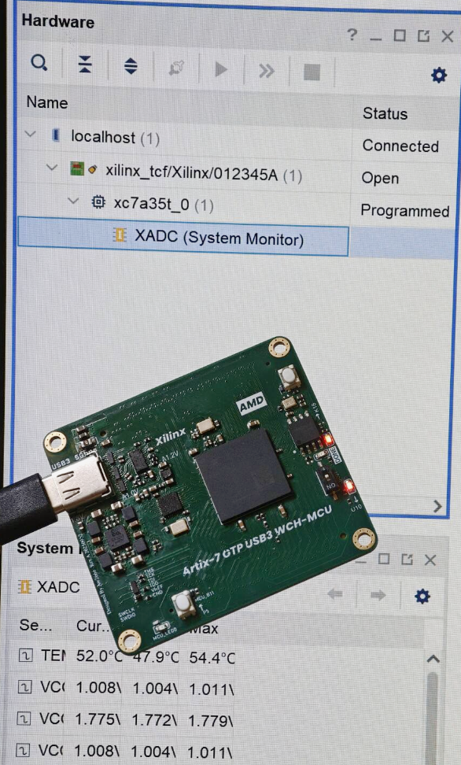

# 说明

为了可以直接在Vivado中使用，这里修改了对应FT2232H的模拟，完善了对Vivado神秘操作的兼容修改。同时为了方便修改代码添加自己的功能，这里移植到WCH官方的HAL库框架上，后期将按照硬件SPI优化来设计。

如果想要模拟其他的FTDI设备，参考Firmware内的开发说明。

# 硬件兼容性

见Hardware内说明，这里测试于这个项目中的板载单片机[alwaysmy/Artix-7_GTP_USB3_WCH_MCU](https://github.com/alwaysmy/Artix-7_GTP_USB3_WCH_MCU)

# 功能兼容性

windows10 vivado 2018.3 vivado 2023.1中测试，下载比特流、烧录Flash、ILA使用测试通过。

这里模拟的EEPROM为93C46, 查阅到有博客说在Windows下Vivado识别没有问题，Linux下则不行，模拟为93C56则都可以兼容，代码中提供了内容，去掉注释即可。也可以按照后面修改自行修改。

通过Zadig替换为WinUSB的驱动之后，OpenOCD可以下载比特流。

其他厂商兼容性见致谢中参考项目内说明。

# 如何修改

## 切换设备

部分工具使用不同的INTERFACE来执行下载，所以可能有切换的需求，在ftdi_dev_cfg.h中按照宏定义切换即可。这里FT4232H没有测试过，相应的没有读取过FT4232H对应的EEPROM，如有需要自己用FT_Prog读取一下。

## 引脚

在MountRiver Studio II中打开ftdi.h，修改引脚对应的宏定义即可，现在的代码只允许TMS和其他三个IO不在一个GPIO端口上，TCK TDI TDO必须在一个GPIO端口上，可以改但是会变慢一点，感觉没啥必要就算了。

代码中预设了两组引脚，一组是SPI2,一组是SPI3,后者兼容CH347的JTAG引脚，串口Debug TX为UART3，通过宏定义切换即可。

## 调试

代码开启了SDI Printf, 如果需要使用需要在下载选项中勾选SDI Printf. 这里所有的打印关闭,如果需要，在MAIN.H和usb_config.h中编辑宏定义打开调试打印。

## 线缆名称

对于USB字符串描述符中的设备显示名称，自行修改即可。对于EEPROM中的内容，部分字符会在Vivado中显示，凭个人爱好可以直接修改，但有些固定字符不能动，具体见开发说明温度，但是最方便的是通过vivado 2022.1之后版本对一个真实的ftdi设备使用program_ftdi编程后，使用FT_Prog读取EEPROM内容后复制粘贴到代码中。

# Buglist和完善

之前遇到过Vivado中，烧录Flash之后，弹出Boot From Configuration Memory Device错误，但是新的代码没遇到过了。。。而且实际上不影响使用。

对于易灵思Efinity Programmer：对于FT2232H，易灵思使用Interface1,这里没有实现，可以自行复制粘贴实现，或者替换实现为FT232H,只有一个通道所以不存在这个问题,代码中已经实现了模拟为FT232H

后期完善代码，部分字节发送的IO操作。

我的板子上引出了一个IO作为按键，方便按键之后把IO都设置为输入，这样可以使用外部调试器。

其实现在凑合了可能懒得改了。

# 致谢

本项目参考于[GitHub - tpunix/FT-LINK: FT2232D emulator](https://github.com/tpunix/FT-LINK?tab=readme-ov-file) 以及 [GitHub - sipeed/RV-Debugger-BL702](https://github.com/sipeed/RV-Debugger-BL702)，

原项目完成了大部分工作，这里表示感谢。

