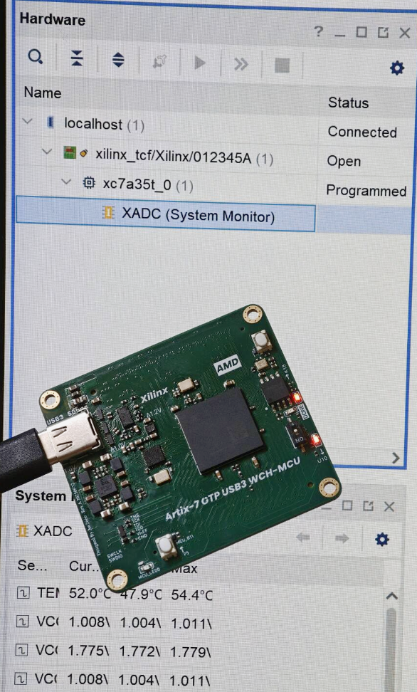

# 说明

为了可以直接在Vivado中使用，这里修改了对应FT2232H的模拟，完善了对Vivado神秘操作的兼容修改。同时为了方便修改代码添加自己的功能，这里移植到WCH官方的HAL库框架上，后期将按照硬件SPI优化来设计。

如果想要模拟其他的FTDI设备，参考Firmware内的开发说明。

# 功能和说明

1. 主要功能：模拟被Vivado编程过的FT2232H/FT232H/FT4232H设备，作为Xilinx FPGA的调试器。
2. 提供IAP功能：便于集成在FPGA单板上时候，不使用额外的下载器可以更新MCU程序。目前使用官方IAP上位机，需要安装官方驱动（安装WCH开发工具的时候自动会安装）。按下PA8按键，跳转IAP的时候设备管理器会出现USB Module字样设备。不过，这样修改之后，直接调试无法启动程序，讲道理可以调试的时候合并下载Bootloader程序，但是我不知道WCH这个工具怎么搞方便，先放着了。。
3. 另外，使用跳转Bootloader功能，可以在想使用外部调试器的时候避免冲突。。。
4.  使用官方IAP上位机的时候，他有BUG,长路径无法识别，把固件复制到桌面就行，目前没打算做兼容他的进入IAP的功能，在APP中点进入IAP无效，在APP中只能按键跳转IAP。他这个IAP上位机又丑又有BUG还要装驱动,后面会换掉的。
5. 官方IAP的程序（后面也叫Bootloader) ,设计他是会在USB模式下会自动检测指定位置是否为默认擦除后数据，不是就直接跳转APP，但是CH32V305GBU6不支持全片擦除，所以这里如果下错了程序他就会变砖，需要重新下载Bootloader, ~~所以我去掉了这个功能，进入IAP之后必须经过USB烧录后会跳转到APP~~，改成了上电（进入IAP的时候）按住按钮就不会跳转到APP，然后正好从APP要更新程序的时候需要按下按钮，其实来不及释放，就是按住了，这里就不会又跳回去了，合理吧。凑合用，后面看看配合APP程序写个专用校验字段还是咋用。官方USB下载Flash有出错的概率。后面不用他的程序了，草，官方USB库根本看不懂。
6. TODO: 提供一个工程模板，保留FT232H设备模拟的功能同时，直接在单片机上编程，便于保留调试FPGA功能的同时可以使用MCU来替代简单的软核工作。例程为启用SPI主机读写FPGA。

# 硬件兼容性

见Hardware内说明，这里测试于这个项目中的板载单片机[alwaysmy/Artix-7_GTP_USB3_WCH_MCU](https://github.com/alwaysmy/Artix-7_GTP_USB3_WCH_MCU)

# 功能兼容性

windows10 vivado 2018.3 vivado 2023.1中测试，下载比特流、烧录Flash、ILA\VIO使用测试通过。

注：VIO能用，但是大部分时候有点慢，有时候下面会报错没获取到状态，但是能用。。。，在Vivado2018.3.1中测试

这里模拟的EEPROM为93C46, 查阅到有博客说在Windows下Vivado识别没有问题，Linux下则不行，模拟为93C56则都可以兼容，代码中提供了内容，去掉注释即可。也可以按照后面修改自行修改。

通过Zadig替换为WinUSB的驱动之后，OpenOCD可以下载比特流。

# 厂商兼容性

其他厂商兼容性见致谢中参考项目内说明，我没有测过，不确定我的改动会不会导致出现问题。

易灵思目前官方工具不支持，连不上，还没看出来哪里不对，后面修。

# 如何修改

## 切换设备

部分工具使用不同的INTERFACE来执行下载，所以可能有切换的需求，在ftdi_dev_cfg.h中按照宏定义切换即可。这里FT4232H没有测试过，相应的没有读取过FT4232H对应的EEPROM，如有需要自己用FT_Prog读取一下。

## 引脚

在MountRiver Studio II中打开ftdi.h，修改引脚对应的宏定义即可，现在的代码只允许TMS和其他三个IO不在一个GPIO端口上，TCK TDI TDO必须在一个GPIO端口上，可以改但是会变慢一点，感觉没啥必要就算了。

代码中预设了两组引脚，一组是SPI2,一组是SPI3,后者兼容CH347的JTAG引脚，串口Debug TX为UART3，通过宏定义切换即可。

## 调试

代码开启了SDI Printf, 如果需要使用需要在下载选项中勾选SDI Printf. 这里所有的打印关闭,如果需要，在MAIN.H和usb_config.h中编辑宏定义打开调试打印。

## 线缆名称

对于USB字符串描述符中的设备显示名称，自行修改即可。对于EEPROM中的内容，部分字符会在Vivado中显示，凭个人爱好可以直接修改，但有些固定字符不能动，具体见开发说明温度，但是最方便的是通过vivado 2022.1之后版本对一个真实的ftdi设备使用program_ftdi编程后，使用FT_Prog读取EEPROM内容后复制粘贴到代码中。

## 去掉IAP功能

可能是为了调试方便（虽然现在不使用调试器下载，这样用Log调试可能更简单），有时候去掉IAP更方便。修改LD文件中的``FLASH (rx) : ORIGIN = 0x00005000, LENGTH = 108K`` 起始地址到0，LENGTH可以依然修改为128K，也可以不动----如果够用的话。

# Buglist和完善

之前遇到过Vivado中，烧录Flash之后，弹出Boot From Configuration Memory Device错误，但是新的代码没遇到过了。。。后来也没遇到过，作为记录。而且实际上不影响使用。

Vivado中VIO有时候会在Tcl Console中报错，但是不影响使用，功能正常。

对于易灵思Efinity Programmer：对于FT2232H，易灵思使用Interface1,这里没有实现，可以自行复制粘贴实现，或者替换实现为FT232H,只有一个通道所以不存在这个问题,代码中已经实现了模拟为FT232H，好像易灵思有个配置文件也可以修改使用的通道，我还没试过。。

后期完善代码，部分字节发送的IO操作。

我的板子上引出了一个IO作为按键，方便按键之后把IO都设置为输入，OK现在这个按键作为Bootloader跳转按键了，也算是实现这个功能了。这样可以使用外部调试器。

目前IAP使用WCH官方程序，有出错概率，即使他不出错，如果你下错程序，一样会变砖。不过好在我给你提供了一个上电按住就会进入Bootloader的功能，重新下载一次就好了。后面不再使用他的上位机。

# 致谢

本项目参考于[GitHub - tpunix/FT-LINK: FT2232D emulator](https://github.com/tpunix/FT-LINK?tab=readme-ov-file) 以及 [GitHub - sipeed/RV-Debugger-BL702](https://github.com/sipeed/RV-Debugger-BL702)，

原项目已经完成了大部分工作，给了我很大启发，这里表示感谢。

# 修改记录

1、2025.x.x  ： 可用版本

2、2025.12.4 ：添加IAP跳转，使用官方IAP上位机（需要安装WCH的驱动）
